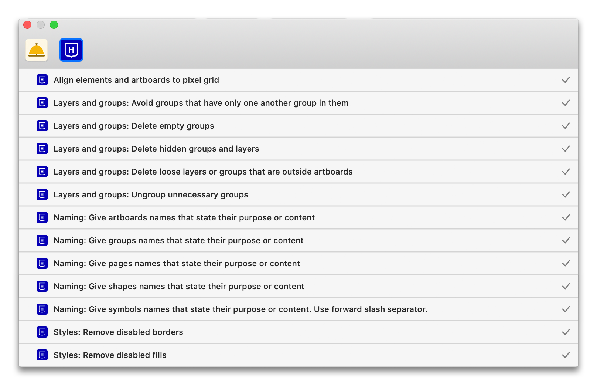

<h1 align="center">HDS Assistant</h1>

  <strong>Sketch Assistant for Helsinki Design System team</strong>

  Keeps our Sketch files consistent :gem: and tidy :broom:

  

  <h4>
    <a href="hds.hel.fi">
      HDS website
    </a>
     | 
    <a href="hds.hel.fi">
      HDS Sketch guidelines
    </a>
     | 
    <a href="https://github.com/YerkoPalma/awesome-choo">
      Contributing
    </a>
     | 
    <a href="https://developer.sketch.com/assistants/">
      Sketch Assistant docs
    </a>
  </h4>

### Features

- **Styles**: makes sure shared styles are used correctly 
- **Layout**: keeps everything aligned to the pixel grid
- **Naming**: prevents default names and enforces descriptive naming
- **Layers and groups**: keeps layers organised and removes redundant ones

### Usage

#### Installing
The easiest way to install HDS Assistant is [to click this link](sketch://add-assistant?url=https://github.com/ronijaakkola/hds-assistant/releases/latest/download/hds-assistant.tgz). The link will automatically install the assistant to your current Sketch file.

You can also download the latest tarball from [releases](https://github.com/ronijaakkola/hds-assistant/releases/latest) and add the archive manually in Sketch assistant window.

#### Updating
Currently Sketch does not update assistants automatically. The only way to update assistant to a newer version is to follow the install instructions again. Upon reinstalling, the old version will be replaced with the new one.

### Rules

#### Styles

:white_check_mark: Respect the shared layer styles. Don’t customise or break the linking to original style.
:white_check_mark: Respect the shared text styles. Don’t customise or break the linking to original style.

### Development

TODO